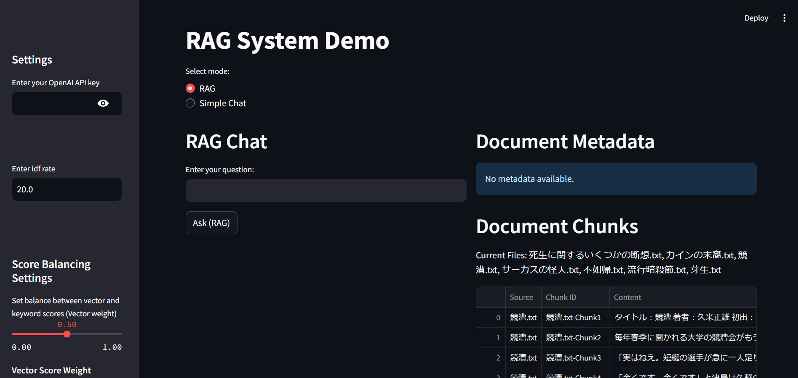

# RAG Application with Streamlit

## Link
https://3fbiunvapkkmmkddrpwdxg.streamlit.app/

## Overview
This is a **Retrieval-Augmented Generation (RAG)** system built with Streamlit. It leverages **OpenAI GPT models**, FAISS for vector-based document search, and Neo4j for graph-based metadata exploration. The application enables efficient question-answering and document metadata extraction for uploaded text files.

## Features
- **Question Answering**: Combines semantic search with retrieval-augmented generation.
- **Document Metadata Extraction**: Extracts and summarizes key information like title, author, and themes.
- **Graph Integration**: Queries metadata using Neo4j for enhanced insights.
- **Customizable Chunking**: Supports dynamic or pre-defined text chunking for efficient processing.

## Demo


## Installation

### 1. Clone the Repository
```bash
git clone https://github.com/yourusername/rag-app.git
cd rag-app
```

### 2. Set Up a Virtual Environment
```bash
python -m venv .venv
source .venv/bin/activate  # On Windows, use .venv\Scripts\activate
```

### 3. Install Dependencies
```bash
pip install -r requirements.txt
```

### 4. Set Up Environment Variables
Add your OpenAI API key to the environment:
```bash
export OPENAI_API_KEY="your-api-key-here"
```

### 5. Run the Streamlit Application
```bash
streamlit run src/app.py
```

## Directory Structure
```
project-root/
├── .venv/                # Virtual environment (not included in version control)
├── data/                 # Data directory
│   ├── raw/              # Raw input files (e.g., query.csv, novels)
├── src/                  # Source code
│   └── app.py            # Main application file
├── .gitignore            # Files and directories to be excluded from version control
├── App_Screenshot.png    # Application screenshot
├── README.md             # Project documentation
└── requirements.txt      # Python dependencies
```

## Usage
1. **Prepare Your Data**: Place `.txt` or `.csv` files in the `data/raw/` directory or upload them via the application.
2. **Run the Application**:
   - Start the application with the Streamlit command provided above.
   - Use the sidebar to upload documents, configure chunking options, and process files.
3. **Interact**:
   - Ask questions in RAG or Simple Chat modes.
   - Extract metadata or download processed results as needed.

## Technologies Used
- **Streamlit**: Provides an interactive user interface.
- **OpenAI GPT**: Powers natural language understanding and generation.
- **FAISS**: Ensures fast and efficient similarity search.
- **Neo4j**: Enhances metadata querying with graph-based storage.

## Contributing
Contributions are welcome! Fork this repository, make improvements, and submit pull requests.

## License
This project is licensed under the MIT License. See the `LICENSE` file for details.
